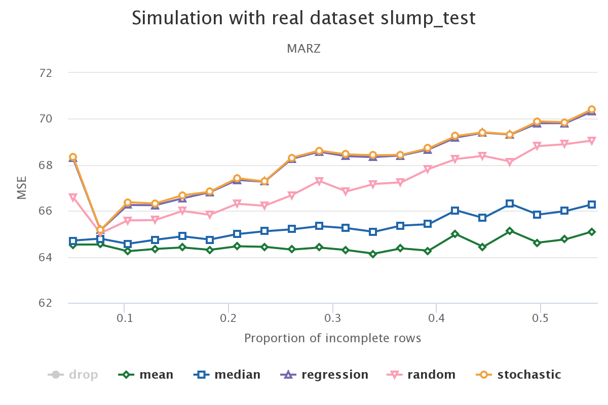

---

### Introduction and affiliations

As an external PhD student, I work under supervision of [Gerko Vink](https://www.gerkovink.com) and [Stef van Buuren](https://github.com/stefvanbuuren) at the Department of Methodology and Statistics, University of Utrecht, the Netherlands. The past year, I developed and implemented multivariate amputation procedure `ampute` (i.e. a way to generate sophisticated missingness in complete datasets). With the availability of `ampute` in R-package `mice`, it has become possible to perform extensive simulation studies to evaluate the effect of missing data methods. My PhD research proposal [About the evaluation of missing data methodologies](pdfs/ResearchProposal_RianneSchouten.pdf) gives some specifics about my current work. 

Furthermore, I work as a Developer Data & Analytics at Samen Veilig Midden-Nederland: an institute that provides universal, preventive and specialized services to youth, parents and elderly. The sensitive and highly classified data at Samen Veilig has to be saved, transformed and analyzed in a standardized and secure way. It will be my job to structure the data flow and to gain and present the necessary insights.

When you get to know me, you will recognize an enthusiastic and motivated person who is always eager to learn. I have an open and direct personality, and some self-deprecating humor. Working with me never becomes boring, since I continuously make new plans or I will make some weird (but funny) statements. First and foremost, I intent to deliver work with a more than good quality. 

---

### Publications

- Schouten, R.M., Lugtig, P.J. and Vink, G. (2017). [Generating missing values for simulation purposes: A multivariate amputation procedure](https://rianneschouten.github.io/mice_ampute/manuscript/manuscript.pdf). [Under review at Journal of Statistical Computation and Simulation]

- Schouten, R.M. and Vink, G. (2017). The dance of the mechanisms: how observed information influences the validity of missingness assumptions. [Under review at Sociological Methods \& Research]

- Kappen, I.F.P.M., Bittermann, G.K.P., Schouten, R.M., Bittermann, D., Etty, E., Koole, R., Kon, M., Van der Molen, M. and Breugem, C.C. (2017). [Long-term mid-facial growth of patients with a unilateral complete cleft of lip, alveolus and palate treated by two-stage palatoplasty: cephalometric analysis](pdfs/CephalometricAnalysis.pdf). Clinical Oral Investigations, 21, pp. 1801-1810.

- de Vries, C.P., Schouten, R.M., Van der Kuur, J., Gottardi, L., and Akamatsu, H. (2016, July). [Microcalorimeter pulse analysis by means of principle component decomposition](pdfs/Microcalorimeter_Pulse_Analysis.pdf). In SPIE Astronomical Telescopes+ Instrumentation (pp. 99055I-99055I). International Society for Optics and Photonics.

---

### Working papers

- Schouten, R.M. (2017) [The effect of missing data mechanisms on the validity of regression coefficients](pdfs/Regression_coefficients_Rianne_Schouten.pdf).

- Schouten, R.M. (2017) Evaluation of missing data methods in the data science framework: a comparison of statistical validity, prediction accuracy and imputation accuracy.

---

### Software development

#### 1. `ampute` in R-package **mice**

```{r, eval = FALSE}
require(mice)
?ampute
```

R-function `ampute` is the implementation of a [multivariate amputation procedure](https://rianneschouten.github.io/mice_ampute/manuscript/manuscript.pdf). With `ampute`, it is straightforward to generate missing values in multiple variables, with different missing data proportions and varying underlying missingness mechanisms. An extensive [vignette](https://rianneschouten.github.io/mice_ampute/vignette/ampute.html) is available.

#### 2. `parlMICE` 

```{r, eval = FALSE}
require(devtools)
source_url('https://raw.githubusercontent.com/RianneSchouten/parlMICE/master/parlMICE.R')
```

With large datasets or with higher number of imputations, performing multiple imputation with `mice` from R-package **mice** might take a long time. As a solution, I created wrapper function `parlMICE` in cooperation with Gerko Vink. With `parlMICE`, the imputation procedure can be run in parallel. A [vignette](https://github.com/RianneSchouten/parlMICE) explaining the value and use of `parlMICE` is available.

#### 3. `pymice`: mice in Python

Although many missing data functions exist in `R`, the collection of missing data functionS in `Python` is quite poor. I created the start of a new package which will eventually consist of three parts: missing data exploration, multivariate amputation and multiple imputation. 

At the moment, the package contains class `McarTests`, which consists of two functions to inspect whether the nonresponse has a MCAR missingness mechanism. Little's MCAR test is implemented in `mcar_test` and for each pair of variables, t-tests can be performed with function `mcar_t_tests`. The code can be found in my Github repository called [`pymice`](https://github.com/RianneSchouten/pymice).

---

### Blogposts

- [Missing Data in Data Science: The effect of missing values treatment on the outcome of a regression model](https://rianneschouten.github.io/missing_data_science/assets/blogpost/blogpost.html)

In this blogpost, I discuss the results of a simulation study. An interactive plot enables everyone to inspect and conclude about the results. Click on the plot below to load the interactive plot. 

[](https://rianneschouten.github.io/missing_data_science/)

- [Omgaan met missing data](https://www.dpadatascience.nl/blog/omgaan-missing-data/)

- [Inzicht in je missing data](https://www.dpadatascience.nl/blog/inzicht-missing-data/)


---

### Talks

- ICT Open 2018

Handling Missing Data in Data Science: Simulating the effects of missing data methods and how to present the results in an interactive plot with Github Pages. Read the [abstract](pdfs/abstract_rianne_schouten.pdf) or check the [slides](pdfs/ictopen2018_RianneSchouten.pdf)

- Data Science Hackathon

A monthly organized data science hackathon will be about missing data problems. I participate in the organization of the hackathon, will provide the attendants with the necessary knowledge and will give them feedback on their approach. My presentation can be found [here](pdfs/Data_Science_Hackathon_Rianne_Schouten.pdf).

- useR!2017 Brussels

My presentation discussed the generation of missing values with `ampute`. A [summary](https://user2017.sched.com/event/AxsS?iframe=no) can be found on the website of the conference. 

- Amst-R-Dam 2017

A bunch of R-enthusiasts listened to me talking about amputation and how to use `ampute` to do this. 

---

### Attended conferences

- ICT Open 2018 [19 and 20 March, 2018]

- Women in Technology [8 and 9 November, 2017]

The [Women in Technology](http://join.europeanwomenintech.com/technology/?gclid=CjwKEAjwruPNBRCKkbL9zqKcrHwSJABGDVyIbRE8y7tfRU6cobtIyGOBlg-HI1dfOAbqvssG35vhnxoC0mHw_wcB) Series enables the sector to connect, learn and act on gender diversity by sharing the experiences of industry leaders and developing women's skills, both soft and technical. I wrote a [blogpost](https://www.linkedin.com/pulse/i-want-go-where-am-invited-included-rianne-schouten/) to share my experiences. 

- useR!2017 Brussels [4 - 7 July, 2017]

The annual [useR!](https://user2017.brussels/) conference is the main meeting of the international R user and developer community.

- CWI in Bedrijf [18 May, 2017]

---

### Contact

- Curriculum Vitae in [English](pdfs/Rianne_Schouten_Resume.pdf).

- Email: r.m.schouten\@uu.nl; riannemargarethaschouten\@gmail.com

- Telephone: +31(0)640640516

- Also see my [Github](https://github.com/RianneSchouten) or [LinkedIn](https://www.linkedin.com/in/rianne-schouten-5bb29491/)

---

### PhD Forms

- Research Proposal: [About the evaluation of missing data methodologies](pdfs/ResearchProposal_RianneSchouten.pdf)

- [Form 1](pdfs/form1_rianneschouten.pdf)

- Education and Supervision Agreement

- [Annual Progress Report 1](pdfs/Annual_Progress_Report_1.pdf)

